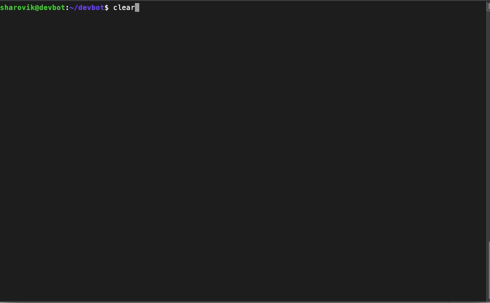

# devbot

This bot can help to automate multiple processes of development and give the possibility to achieve more goals for less time.

## Table of contents
- [Available features](#generate-wordpress-template)
- [Getting Started](#getting-started)
- [Prerequisites](#prerequisites)
- [Installation](#installation)
- [How to use](#how-to-use)
- [Custom events](#custom-events)
- [Dictionary](#dictionary)
- [Authors](#authors)
- [License](#license)

## Available features
* [trigger custom events by personal message or triggering bot in the channel](documentation/events.md)
* [create the WordPress template just by uploading the file to the specific channel or to the PM of the bot](#generate-wordpress-template)

## Getting Started

These instructions will help you to install the bot to your server (local, development, production).

## Prerequisites

### Enable CGO
Because here we use the CGO package for *sqlite* driver, please enable the environment variable `CGO_ENABLED=1` and have a `gcc` compile present within your path.

### Slack token generation
Before the installation I would recommend to prepare the slack application for your account. 
1. Go to [applications page](https://api.slack.com/apps?new_app=1) of slack and create new application there
2. Once new application was created you will be redirected to the application `Basic Information` page, where you have to click in the `Building Apps for Slack` section to the `Add features and functionality` block. There you need to click to the `Bots` button.
3. Add a Bot user. Specify the `Display name`, `Default username` and his `online status`
4. After you created a bot user, please go back to the `Basic Information` page and install your app to your workspace. You can find the `Install your app to your workspace` button in the `Building Apps for Slack` section.
5. Now you need to get the OAuth tokens for our bot user. For that please go to `OAuth & Permissions`, there you will find the `Bot User OAuth Access Token` which appears only after application installation to your slack account. This token you will need to specify in .env configuration file of your bot

### Install sqlite3
We are using the sqlite3 as main storage of our questions and answers data. To exclude errors related to unknown library sqlite3, please install it.
You can use this command for ubuntu
```
sudo apt-get install sqlite3 libsqlite3-dev
```
Or by using brew
```
brew install sqlite
```
Or for centos
```
sudo yum install sqlite
```

### Prepare project for compilation
Every package should have a .go file inside of the dir. `events` folder it is a defined package. There you can configure the list of events which should have the bot. If you will skip this step, the error will appear because the events are not defined at all. Please do the following step:
```
cp events/defined-events.go.dist events/defined-events.go
```
This will fix the issue wiith undefined `events` package, which might happen during project compilation locally.

### PHP installation
You server requires php version of 7.1+ with php-dom module. `It is only required if you will use the wordpress template generation event.`
For ubuntu
```
sudo apt install php php-dom
```
Or for brew
```
brew install php
```
Or for centos
```
yum install php php-xml
```
## Installation

1. Go to [this page](https://github.com/sharovik/devbot) and clone latest version of devbot. Or run this command:
``` 
git clone git@github.com:sharovik/devbot.git
```
2. Prepare the configuration file for our bot. Create `.env` file in the project directory and copy contents of the `.env.example` file there.
```
cp .env.example .env
```
3. Please create the Events configuration file. The reason why this step is required [you can find here](#prepare-project-for-compilation).
``` 
cp events/defined-events.go.dist events/defined-events.go
```
4. Set the value from [`Bot User OAuth Access Token`](#slack-token-generation) into *SLACK_OAUTH_TOKEN* variable from the `.env` file
5. Run bot by using command `./bin/slack-bot-{YOUR_SYSTEM}` you should see in the logs `hello` message type. It means that the bot successfully connected to your account


## How to use

### Generate WordPress template

1. Prepare a `*.twig` template and compress it in a `*.zip` file ([here you can find the example of template](https://github.com/sharovik/themer)) 
2. Open PM of the bot, channel where this bot was added or tag bot-user during the attachment send
3. In attachment popup please write in comment field `process` word and send the attachment
4. After bot received your attachment you will see the answer
 >Please, wait a bit. I have to process this file
 
 Up to 4 seconds will take to process the template
5. After template was processed you will receive in answer new archive where you will find `html preview of your template` and WordPress template

## Custom events
Please read the [events documentation](documentation/events.md)

## Dictionary
Please read the [dictionary documentation](documentation/dictionary.md)

## Project build
For project build please follow these steps:
1. Your project should be in GOPATH folder or GOPATH should point to the directory where you clone this project 

## Authors

* **Pavel Simzicov** - *Initial work* - [sharovik](https://github.com/sharovik)

## License
This project is licensed under the BSD License - see the LICENSE.md file for details
