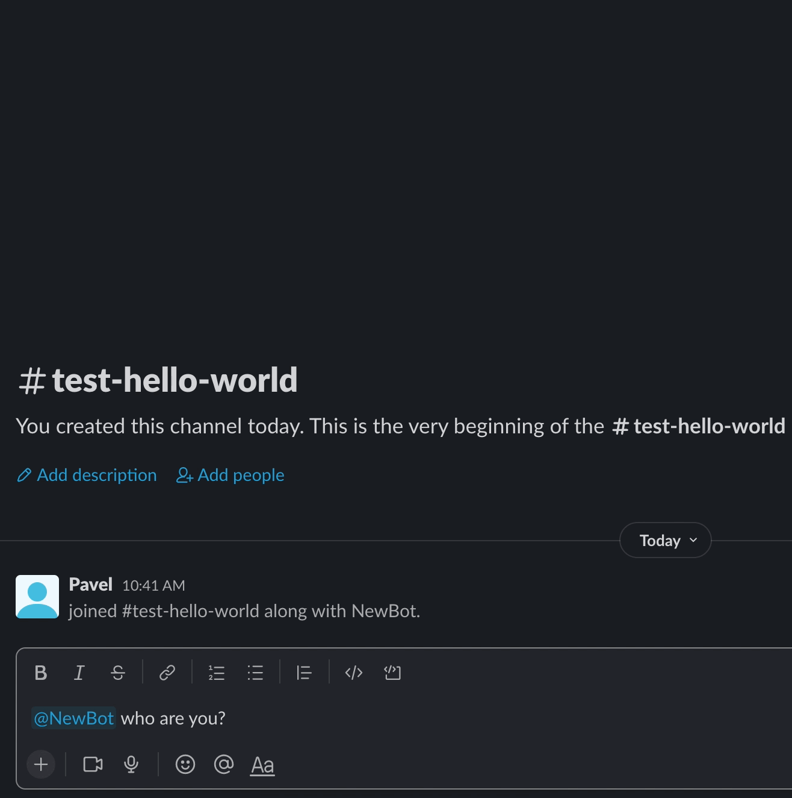

# devbot
[](https://gitter.im/devbot-tool/community?utm_source=badge&utm_medium=badge&utm_campaign=pr-badge)

Free, opensource "ChatBot" project, based on GoLang. Using this project you can build your custom simple bot, which can execute the commands you need.



## Table of contents
- [How to run](#how-to-run)
- [Prerequisites](documentation/prerequisites.md)
- [Install to AWS](documentation/terraform-aws-setup.md)
- [How to write custom event](documentation/events.md)
- [How to build scenario](documentation/scenarios.md)
- [Migrations](documentation/migrations.md)
- [Features out of the box](documentation/features-out-of-the-box.md)
- [Internal functionalities](documentation/available-features.md)
- [Events available for installation](#custom-events-available-for-installation)
- [Project build](documentation/build.md)
- [Authors](#authors)
- [License](#license)

## How to run

Build the project, [you can find the instructions here](documentation/build.md)

Once project build finished, please run the following command:
**For macOS and Linux**
``` 
./bin/devbot-current-system
```
For windows
``` 
start bin\devbot-current-system.exe
```

### Run by using docker
**Before run, make sure you created `.env` file and set up the credentials**

1. Build the image. To do that, please run the following command:
``` 
docker build --target base -t devbot-app-base:latest .
docker build --target run -t devbot-app-run:latest .
```
2. If build was successful, please use the following command to run the container
```
docker run --env-file=.env devbot-app-run:latest
```

### Run using docker compose
Execute command `docker compose up`

## Custom events available for installation
Here you can find an examples of custom events, which are ready for installation
- [WordPress theme generation event](https://github.com/sharovik/themer-wordpress-event)
- [BitBucket release event](https://github.com/sharovik/bitbucket-release-event)
- [BitBucket run pipeline event](https://github.com/sharovik/bitbucket-run-pipeline)

## Authors
* **Pavel Simzicov** - *Main work* - [sharovik](https://github.com/sharovik)

### Vendors used
* github.com/joho/godotenv - for env files loading
* github.com/sharovik/orm - the ORM for database queries
* github.com/karalabe/xgo - for cross-platform build
* github.com/pkg/errors - for errors wrapper and trace extracting in logger
* github.com/rs/zerolog - for logger
* github.com/stretchr/testify - for asserts in tests
* golang.org/x/net - for websocket connection

## License
This project licensed under the BSD License - see the [LICENSE.md](LICENSE.md) file for details
