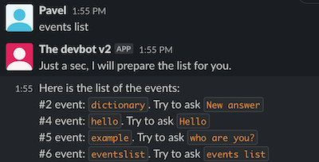
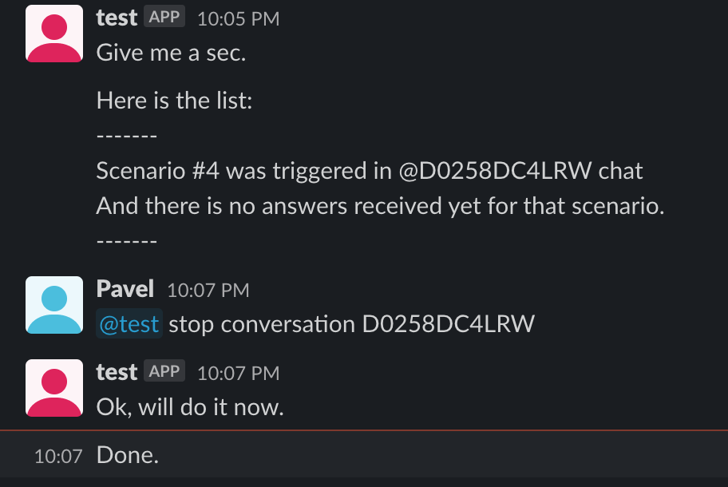
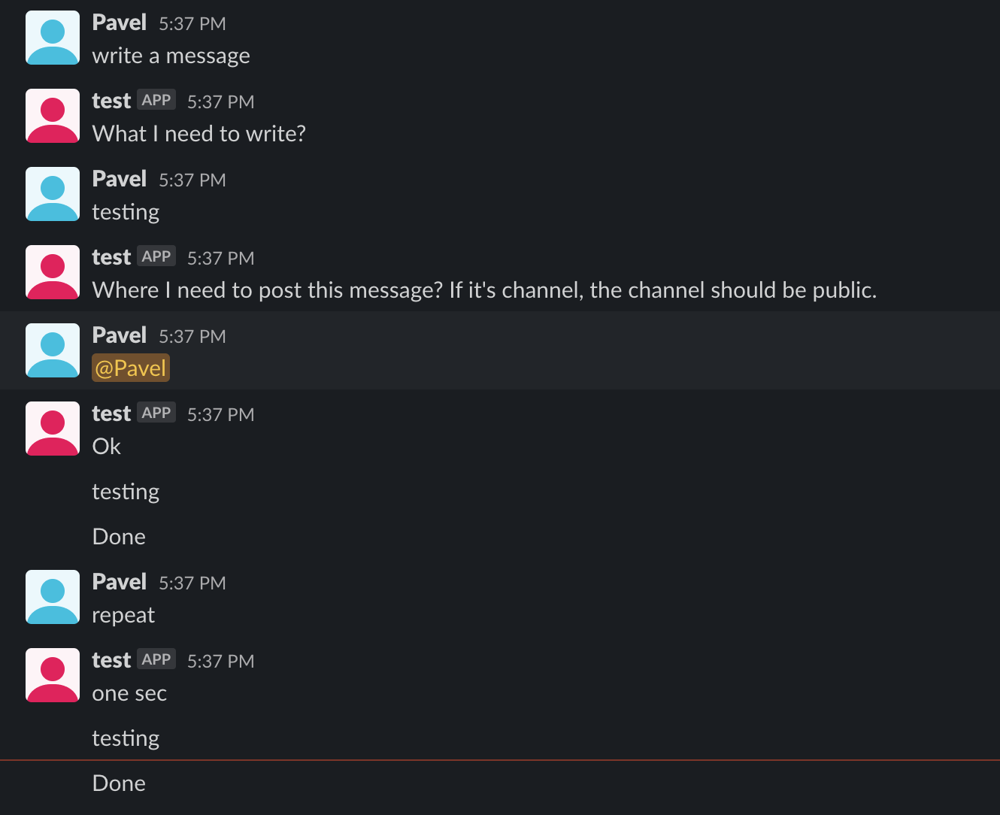

# devbot
[](https://gitter.im/devbot-tool/community?utm_source=badge&utm_medium=badge&utm_campaign=pr-badge)

This is a free, opensource chat-bot framework, based on GoLang. Using this framework you can set-up a custom bot, which can execute the commands you need.

## Features out of the box
Here is the list of current events, which comes out of the box.

### Unknown question
If bot don't know how to answer, he will try to find potential events using the words from your question


### Current installed events
Ask bot `events list` to see the list of available events. This is useful, when you don't know which event what command have.



### Help of event
Each event should have `--help` feature. So, once you don't know how to use selected event, please type `--help` after the event command


### Example of scenario
There is an example event, which you can use as skeleton for your custom scenarios


### List open conversations
You can always control open conversations


### Stop conversation
You always can stop open conversations


### Repeat last event
When you have triggered already the event, let's say, "staging deployment" and you need to re-deploy. You can ask bot to repeat the previous scenario you triggered in that channel.


## Table of contents
- [How to run](#how-to-run)
- [Prerequisites](documentation/prerequisites.md)
- [Installation](documentation/installation.md)
- [Install to AWS](documentation/terraform-aws-setup.md)
- [How to write custom event](documentation/events.md)
- [How to build scenario](documentation/scenarios.md)
- [Migrations](documentation/migrations.md)
- [Available events](documentation/available-features.md)
- [Events available for installation](#events-available-for-installation)
- [How to add new questions into the database](documentation/dictionary.md)
- [Project build](documentation/build.md)
- [Authors](#authors)
- [License](#license)

## How to run

### Run from pre-compiled binary files
This is the fastest way of the project setup.
1. [Clone the latest version](https://github.com/sharovik/devbot/releases/latest)
2. Go to project directory
3. Run `make build` - to build chatbot binary for your system
4. Start the bot:
**For MacOS and Linux**
``` 
./bin/slack-bot-{YOUR_SYSTEM}
```
For windows
``` 
start bin\slack-bot-windows-{TYPE_OF_SYSTEM}.exe
```

**Note! Before the project build, please see the instructions, [you can find the instructions here](documentation/build.md)**

Once project build finished, please run the following command
**For MacOS and Linux**
``` 
./bin/slack-bot-current-system
```
For windows
``` 
start bin\slack-bot-current-system
```

### Run by using docker
This project also support the Docker.
1. Clone the project into your working directory, go into that directory and run the following command
``` 
docker build . -t devbot-dock
```
2. If build was successful, please use this command to start the container
```
docker run --env-file=.env devbot-dock
```

**Before run, make sure you created .env file and setup the credentials**

### Example of output
If you did everything right, after project start you should see something like this:


## Custom events available for installation
- [WordPress theme generation event](https://github.com/sharovik/themer-wordpress-event)
- [BitBucket release event](https://github.com/sharovik/bitbucket-release-event)
- [BitBucket run pipeline event](https://github.com/sharovik/bitbucket-run-pipeline)

## Authors
* **Pavel Simzicov** - *Initial work* - [sharovik](https://github.com/sharovik)

### Vendors used
* github.com/joho/godotenv - for env files loading
* github.com/sharovik/orm - the ORM for database queries
* github.com/karalabe/xgo - for cross platform build
* github.com/karupanerura/go-mock-http-response - for http responses mocking in tests
* github.com/mattn/go-sqlite3 - for sqlite connection
* github.com/pkg/errors - for errors wrapper and trace extracting in logger
* github.com/rs/zerolog - for logger
* github.com/stretchr/testify - for asserts in tests
* golang.org/x/net - for websocket connection

## License
This project licensed under the BSD License - see the [LICENSE.md](LICENSE.md) file for details
