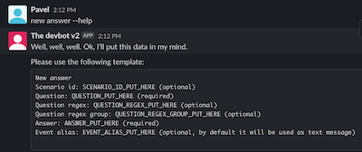

# devbot
[](https://gitter.im/devbot-tool/community?utm_source=badge&utm_medium=badge&utm_campaign=pr-badge)

This bot can help you to automate multiple processes of development and give the possibility to achieve more goals for less time.

## Table of contents
- [How to run](#how-to-run)
- [Prerequisites](#prerequisites)
- [Installation](#installation)
- [Available events](#available-events)
- [How to write custom event](#how-to-write-custom-event)
- [How to add new questions into the database](#how-to-add-new-questions-into-the-database)
- [Project build](#project-build)
- [Authors](#authors)
- [License](#license)

## How to run

### Run from pre-compiled binary files
This is the fastest way of the project setup.
1. [Download latest version](https://github.com/sharovik/devbot/releases/latest) of project archive
2. Unpack it somewhere in your machine
3. Run the bot by using next command:
**For MacOS and Linux**
``` 
./bin/slack-bot-{YOUR_SYSTEM}
```
For windows
``` 
start bin\slack-bot-windows-{TYPE_OF_SYSTEM}.exe
```

### Run after project build
Before run, please make sure you follow build instructions, which [you can find here](documentation/build.md).

Once project build was finished, please run the following command
**For MacOS and Linux**
``` 
./bin/slack-bot-current-system
```
For windows
``` 
start bin\slack-bot-current-system
```

### Run by using docker
This project also support the Docker.
1. Clone the project into your working directory, go into that directory and run the following command
``` 
docker build . -t devbot-dock
```
2. If build was successful, please use this command to start the container
```
docker run --env-file=.env devbot-dock
```

``Before run, make sure you created .env file and setup the credentials``

### Example of output
If you did everything right, you should see something like this:


## Prerequisites
Please read the [prerequisites documentation](documentation/prerequisites.md)

## Installation
Please read the [installation documentation](documentation/installation.md)

## Help triggers
You can always ask bot to help you, if you don't know what kind of features currently are available or if you need detailed help regarding to the event.
### Current installed events
Ask bot `events list` to see the list of available events. This is useful, when you don't know which event what command have.


### Help of event
Each event should have `--help` feature. So, once you don't know how to use selected event, please type `--help` after the event command


## Available events
- [WordPress theme generation event](https://github.com/sharovik/themer-wordpress-event)
- [BitBucket release event](https://github.com/sharovik/bitbucket-release-event)
- [BitBucket run pipeline event](https://github.com/sharovik/bitbucket-run-pipeline)

## How to write custom event
Please read the [events documentation](documentation/events.md). There you can find an example of the custom event.

## How to add new questions into the database
Please read the [dictionary documentation](documentation/dictionary.md)

## Project build
Please read the [build documentation](documentation/build.md)

## Authors

* **Pavel Simzicov** - *Initial work* - [sharovik](https://github.com/sharovik)

### Vendors used
* github.com/joho/godotenv - for env files loading
* github.com/karalabe/xgo - for cross platform build
* github.com/karupanerura/go-mock-http-response - for http responses mocking in tests
* github.com/mattn/go-sqlite3 - for sqlite connection
* github.com/pkg/errors - for errors wrapper and trace extracting in logger
* github.com/rs/zerolog - for logger
* github.com/stretchr/testify - for asserts in tests
* golang.org/x/net - for websocket connection

## License
This project is licensed under the BSD License - see the LICENSE.md file for details
