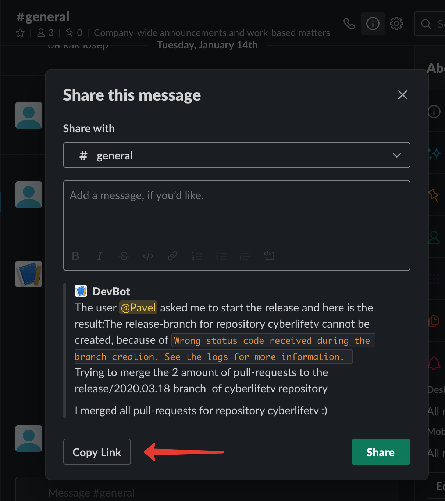

# BitBucket client configuration
For this you need to do the following steps:
1. Go to your workspace settings in bitbucket.org
2. Under the **APPS AND FEATURES** section you will find `OAuth`, please go there
3. In the OAuth page you will find `OAuth consumers`. Please add new consumer with the following checked permissions:
- Pull requests: Read, Write
- Repositories: Read, Write
- Pipelines: Read
And also please mark this consumer as "Private".
See example of the filled form:


4. After form submit you will receive the client credentials, please use them to fill these attributes in your `.env` file:
```
BITBUCKET_CLIENT_ID=
BITBUCKET_CLIENT_SECRET=
```

## Prepare required reviewers
This will be used in the pull-request checks and for release pull-request creation 
1. Please go to BitBucket profile page of the reviewer and copy the UUID from the url. There should be something like this:
`https://bitbucket.org/%7Bsome-bitbucket-uuid-is-here%7D/`. From that string you take the UUID and put it in curly brace `{some-bitbucket-uuid-is-here}`
2. In the slack, please find the related member and get his member ID. Just view the profile, click to the options button and you will find the member id there.
See example:

Click to copy this member ID 
3. Add the reviewers into `BITBUCKET_REQUIRED_REVIEWERS` attribute in the `.env` with the following structure:
```
BITBUCKET_REQUIRED_REVIEWERS=SLACK-MEMBER-ID1:{some-bitbucket-uuid-is-here1},SLACK-MEMBER-ID1:{some-bitbucket-uuid-is-here2}
```
As you can see, you can add multiple reviewers by using comma.

## Prepare current user UUID
This will be used during the release pull-request creation. The current user cannot add into reviewers of his pull-request him-self. To prevent this we need to understand which UUID is the UUDI of current consumer.
1. Please go to your BitBucket profile page and copy the UUID from the url. There should be something like this: `https://bitbucket.org/%7Bsome-bitbucket-uuid-is-here%7D/`. From that string you take the UUID and put it in curly brace `{some-bitbucket-uuid-is-here}`
2. Put the value into `BITBUCKET_USER_UUID` attribute
```
BITBUCKET_USER_UUID={some-bitbucket-uuid-is-here}
```

## [Optional] Release status update in the selected channel
This option will everyone in selected channel about the release status update
To enable this option you need to do the following steps:
1. Set `BITBUCKET_RELEASE_CHANNEL_MESSAGE_ENABLE` to `true`
```
BITBUCKET_RELEASE_CHANNEL_MESSAGE_ENABLE=true
``` 
2. Set the slack channel ID. Go to selected channel in slack, select the message from this channel and try to share it. In the popup you will see `Copy link` button. Copy the link and extract from this link the `CHANNEL-ID` part
Example: `https://you-team.slack.com/archives/CHANNEL-ID/p1574500945000200`. Usually the channel ID starts from `C`.


3. Put the channel ID into `BITBUCKET_RELEASE_CHANNEL` variable in your `.env` file
``` 
BITBUCKET_RELEASE_CHANNEL=CHANNEL-ID
```
