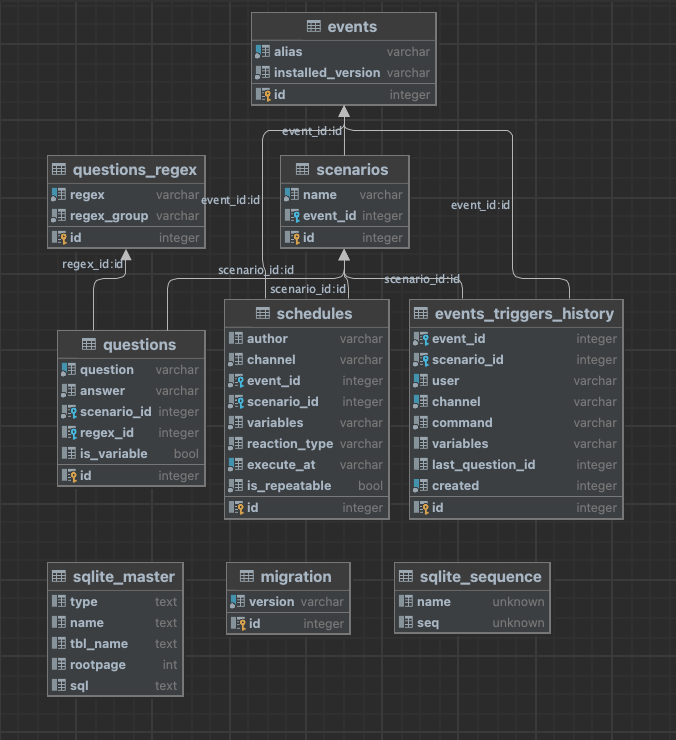

##Dictionary
This is the functionality by which the DevBot understand what kind of the event he need to trigger for your message.

## Table of contents
- [The dictionary database](#the-dictionary-database)
-- [The database structure](#the-database-structure)
-- [The tables](#the-tables)
- [Generator tool](#generator-tool)
-- [Attributes](#attributes)
-- [Example of generator tool execution](#example-of-generator-tool-execution)

## The dictionary database
The SQLite database used as a main storage for questions and answers. You can find it in the root directory of the project (`devbot.sqlite`).

### The database structure


### The tables
1. events - the table which contains the events which will be triggered after answer preparing. Ex. `themerwordpress` event
2. questions - the table which contains the questions and answers
3. scenarios - the table for different scenarios creation

## Generator tool
There is a tool which you can use for creation of new questions and answers for our dictionary. You can find this tool here `scripts/dictionary-loader/dictionary-loader`

### Attributes
Below you can see the description for each field of the question and answer object
* **question** - the question text. Example: `Hello, my name is John`
* **question_regex** - regexp for question. Please see [the GOLang regex syntax documentation](https://golang.org/pkg/regexp/syntax/)!. Example: `(?i)Hello, my name is (?<name>\w+)`
* **question_regex_group** - the regexp group which will be used for identifying of the part of the question which we need to use for the answer. Example: Question received `Hello, my name is John`, we have regexp for it `(?i)Hello, my name is (?P<name>\w+)` and we have there group `<name>`. This group will be used during answer generation 
* **answer** - answer text. Example: `Hello %s` or `Hello`, where `%s` we need to use only in case if we used `question_regex` and `question_regex_group` attributes
* **event_alias** - the name of the event which should be triggered after the message answer prepare. Example: see [events documentation](events.md)

### Example of generator tool execution
``` 
./scripts/dictionary-loader/dictionary-loader --question="Hello, my name is John" --question_regex="(?i)Hello, my name is (?P<name>\w+)" --question_regex_group=name --answer="Hello %s" --event_alias="hello"
```