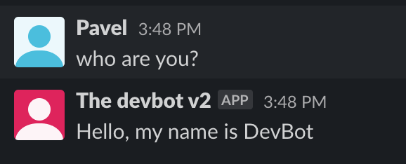
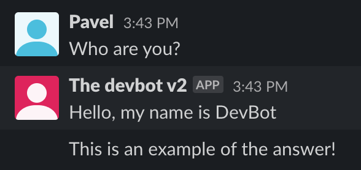

# Events
This feature will help you to improve the skills of your bot. With it you are able to create your own event for your custom message.

## Table of contents
- [Good to know](#good-to-know-for-event-setup)
- [Prerequisites](#prerequisites)
- [Event setup](#event-setup)
- [Example](#example)

## Good to know for event setup
- `defined-events.go.dist` file example which contains the way of how to load your custom events
- [the event message object](event-message.md) - there you can find more details about event message object

## Prerequisites
* run `cp defined-events.go.dist defined-events.go` to create the file where you will define your events

## Event setup
* create your event directory in `events` directory. Ex: `events/my-brand-new-event`
* create in your new directory file with name `my-event`. There is no black magic inside the naming, we just introduce the structured way of how to define the event files.
* create the logic for your new event struct object and make sure that this logic is compatible with the interface `events.Event`, which you can find this interface here `events/1/main-event.go:3`
* add your object to the "map" of the events `events.DefinedEvents` in init method of defined-events.go file 
```DefinedEvents.Events["CUSTOM_EVENT"] = your_package.Event```
* add to the dictionary, message regex by which your event will be triggered

## Example
Now let's take a deep dive into custom event creation and create a custom event.

### Prepare event folder
You need to specify the folder name without spaces. There should not be dashes or underscores in the package name, so please make sure you use a proper naming.
Let's call it `example` and create this example folder in the `events` folder.

### The code
There is a [Base event interface](../events/base/base-event.go) which defines the structure of each event. So, let's create our custom event using this base interface definition:
```go
package example

import (
	"fmt"

	"github.com/sharovik/devbot/internal/log"

	"github.com/sharovik/devbot/internal/container"
	"github.com/sharovik/devbot/internal/dto"
)

const (
	//EventName the name of the event
	EventName = "example"

	//EventVersion the version of the event
	EventVersion = "1.0.1"

    //The migrations folder, which can be used for event installation or for event update
	migrationDirectoryPath = "./events/example/migrations"
)

//ExmplEvent the struct for the event object. It will be used for initialisation of the event in defined-events.go file.
type ExmplEvent struct {
	EventName string
}

//Event - object which is ready to use
var Event = ExmplEvent{
	EventName: EventName,
}

//Execute method which is called by message processor
func (e ExmplEvent) Execute(message dto.BaseChatMessage) (dto.BaseChatMessage, error) {
    //This answer will be show once the event get triggered.
    //Leave message.Text empty, once you need to not show the message, once this event get triggered.
	message.Text = "This is an example of the answer."
	return message, nil
}

//Install method for installation of event
func (e ExmplEvent) Install() error {
	log.Logger().Debug().
		Str("event_name", EventName).
		Str("event_version", EventVersion).
		Msg("Triggered event installation")

	return container.C.Dictionary.InstallEvent(
		EventName,                                                                   //We specify the event name which will be used for scenario generation
		EventVersion,                                                                //This will be set during the event creation
		"who are you?",                                                              //Actual question, which system will wait and which will trigger our event
		fmt.Sprintf("Hello, my name is %s", container.C.Config.SlackConfig.BotName), //Answer which will be used by the bot
		"",                                                                          //Optional field. This is regular expression which can be used for question parsing.
		"",                                                                          //Optional field. This is a regex group and it can be used for parsing the match group from the regexp result
	)
}

//Update for event update actions
func (e ExmplEvent) Update() error {
	return container.C.Dictionary.RunMigrations(migrationDirectoryPath)
}
```

### Result
#### With empty text message in the Execute method


#### With the filled text message in the Execute method


### Source code
You can find the source code of the event in [events/example](https://github.com/sharovik/devbot/tree/master/events/example) folder