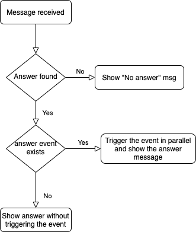
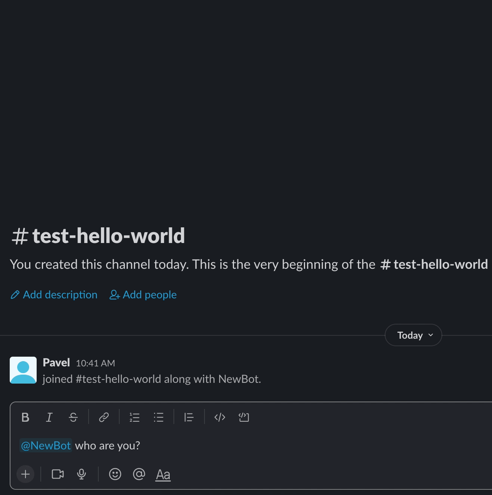

# Events
This feature will help you to improve the skills of your bot. With it you are able to create your own event for your custom message.

## Table of contents
- [Good to know](#good-to-know-for-event-setup)
- [Prerequisites](#prerequisites)
- [The event diagram](#the-event-diagram)
- [Event setup](#event-setup)
- [Example](#example)

## Prerequisites
* run `cp defined-events.go.dist defined-events.go` to create the file where you will define your events

## The event diagram


## Event setup
* create your event directory in `events` directory. Ex: `events/mybrandnewevent`
* create in your new directory file with name `event.go`. There is no black magic inside the naming, we just introduce the structured way of how to define the event files.
* create the logic for your new event struct object and make sure this logic is compatible with the interface `container.DefinedEvent`
* add your object to the "map" of the events `events.DefinedEvents` in the `defined-events.go` file 
```go
var DefinedEvents = map[string]container.DefinedEvent{
    //...
	mybrandnewevent.EventName: mybrandnewevent.Event,
}
```

## Example
Now let's take a deep dive into custom event creation and create a custom event.

### Prepare event folder
You need to specify the folder name without spaces. There should not be dashes or underscores in the package name, so please make sure you use a proper naming.
Let's call it `example` and create this example folder in the `events` folder.

### The code
There is a [Base DefinedEvent interface](../internal/dto/event/defined_event.go) which defines the structure of each event.
The main methods are:
- `Install` - method, which install the scenarios for your event
- `Update` - once you introduce a migration for your event, this method will be triggered and migration will be applied
- `Execute` - main method for event logic execution. This method receives as argument the [message object](event-message.md) type of `dto.BaseChatMessage`.

Below, you can find an example of the event, which you can use as the base for your event
```go
package example

import (
	"fmt"

	"github.com/sharovik/devbot/internal/database"

	"github.com/sharovik/devbot/internal/log"

	"github.com/sharovik/devbot/internal/container"
	"github.com/sharovik/devbot/internal/dto"
)

const (
	//EventName the name of the event
	EventName = "example"

	//EventVersion the version of the event
	EventVersion = "1.0.1"

	helpMessage = "Ask me `who are you?` and you will see the answer."
)

// EventStruct the struct for the event object. It will be used for initialisation of the event in defined-events.go file.
type EventStruct struct {
}

// Event - object which is ready to use
var Event = EventStruct{}

func (e EventStruct) Help() string {
	return helpMessage
}

func (e EventStruct) Alias() string {
	return EventName
}

// Execute method which is called by message processor
func (e EventStruct) Execute(message dto.BaseChatMessage) (dto.BaseChatMessage, error) {
	//This answer will be show once the event get triggered.
	//Leave message.Text empty, once you need to not show the message, once this event get triggered.
	message.Text = "This is an example of the answer."
	return message, nil
}

// Install method for installation of event
func (e EventStruct) Install() error {
	log.Logger().Debug().
		Str("event_name", EventName).
		Str("event_version", EventVersion).
		Msg("Triggered event installation")

	return container.C.Dictionary.InstallNewEventScenario(database.EventScenario{
		EventName:    EventName,
		EventVersion: EventVersion,
		Questions: []database.Question{
			{
				Question:      "who are you?",
				Answer:        fmt.Sprintf("Hello, my name is %s", container.C.Config.MessagesAPIConfig.BotName),
				QuestionRegex: "(?i)who are you?",
				QuestionGroup: "",
			},
		},
	})
}

// Update for event update actions
func (e EventStruct) Update() error {
	return nil
}
```

### Result
#### With empty text message in Execute method


#### With the filled text message in Execute method


### Source code
You can find the source code of the event in [events/example](https://github.com/sharovik/devbot/tree/master/events/example) folder