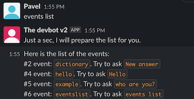
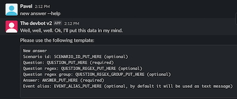
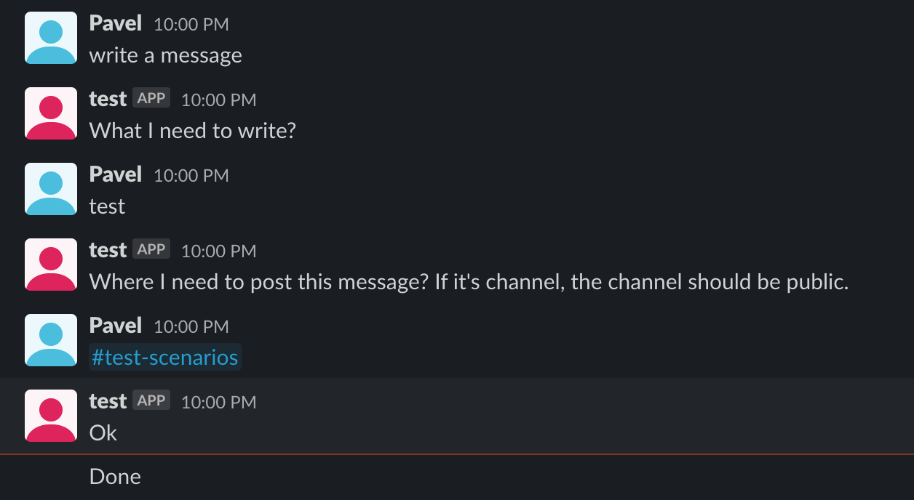
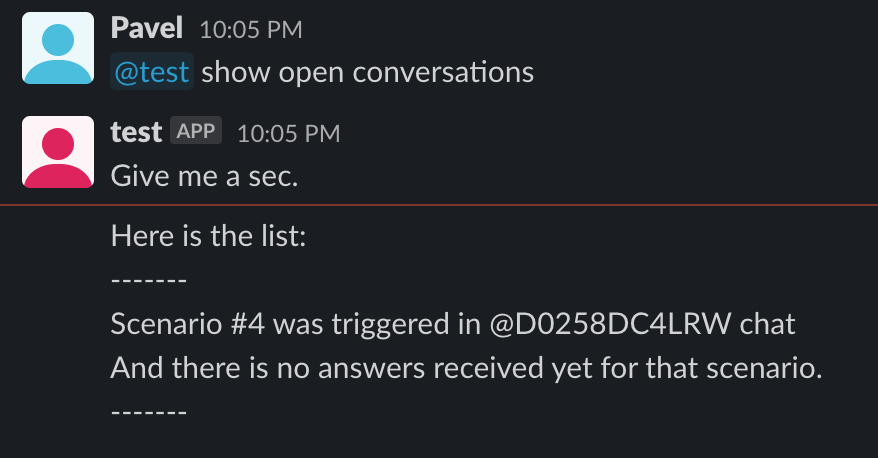
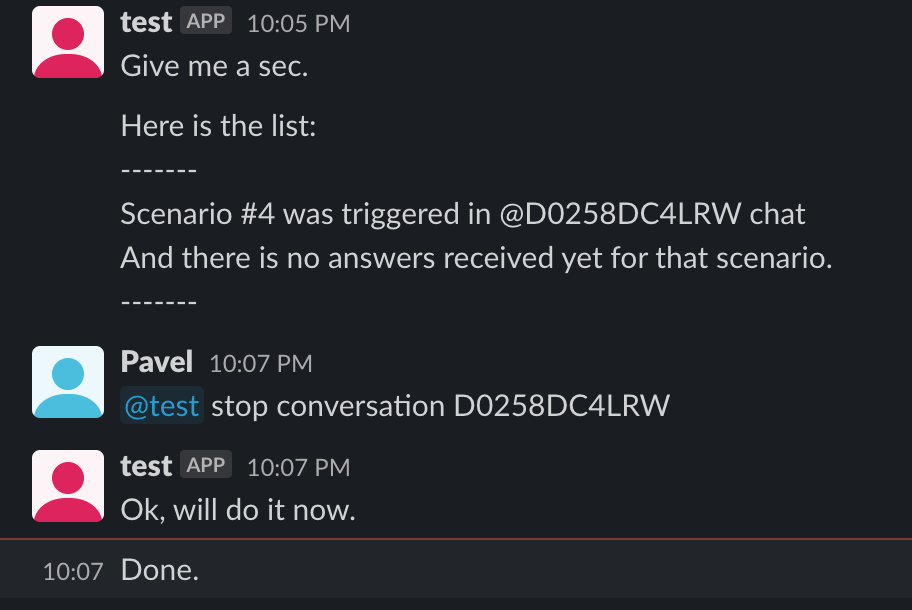
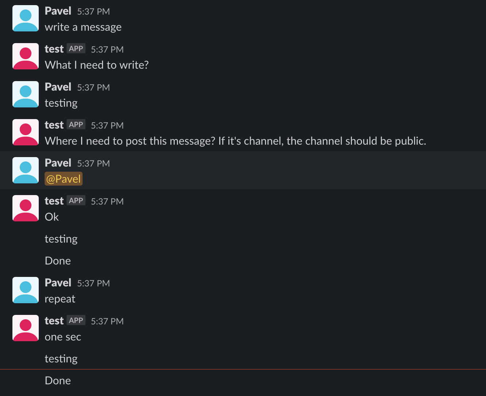

# Features out of the box
Here is the list of current events, which comes out of the box.

## Unknown question
If bot don't know how to answer, he will try to find potential events using the words from your question

## Current installed events
Ask bot `events list` to see the list of available events. This is useful, when you don't know which event what command have.

## Help of event
Each event should have `--help` feature. So, once you don't know how to use selected event, please type `--help` after the event command

## Example of scenario
There is an example event, which you can use as skeleton for your custom scenarios

## List open conversations
You can always control open conversations

## Stop conversation
You always can stop open conversations

## Repeat last event
When you have triggered already the event, let's say, "staging deployment" and you need to re-deploy. You can ask bot to repeat the previous scenario you triggered in that channel.

