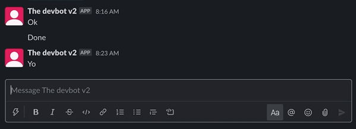
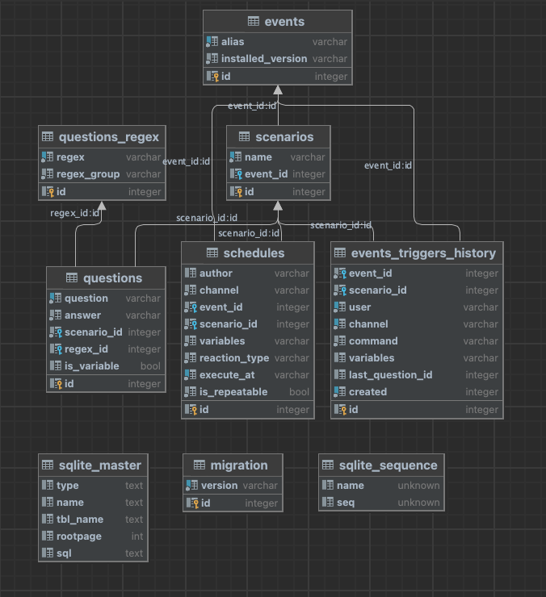
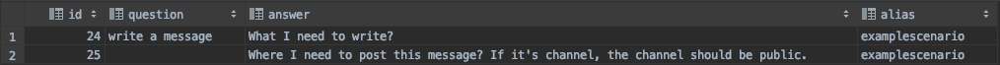
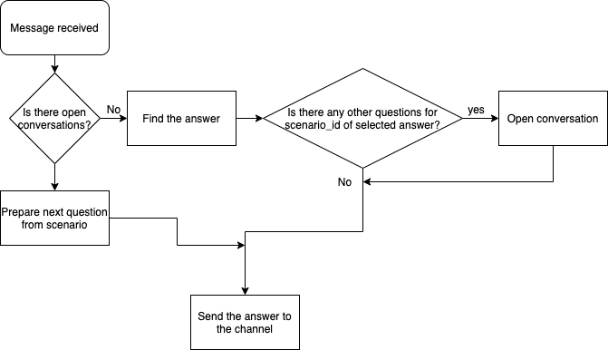

# Scenarios
This feature can help with attributes guessing for your custom event. 
Imagine user triggered your event, but unfortunately from the message bot cannot parse all the attributes. In this case, instead of throwing of error message, you can trigger the scenario for your event, which will ask a questions and set needed variables for your custom event.

## Demo
### With tagging of the bot-user


### Without tagging of the bot-user


### How to stop active scenario
To stop the scenario, please use the following phrases:
- `stop!`
- `stop scenario!`
Once bot receives some of these phrases, he will try to stop the active scenario in the current channel, where the message posted.

## Database
Before describing of the code base, let's check the database schema and see how on the database level the scenario looks like.
First, let's have a look on the database schema



As you can see we have the scenario_id in the questions table. This field will be used for grouping of the questions.

On the screenshot below you can see that not each question row has the filled `question attribute`. This is because initially `question` attribute of `questions` table is used as the **question from the user** and `answer` field is used as **answer from the bot**.
And in case of the scenario, the bot **asks user** and **we don't expect the question** from the user.
 


The query which is used here

```sql
select q.id, q.question, q.answer, e.alias
from questions q
join scenarios s on q.scenario_id = s.id
join events e on s.event_id = e.id
where s.id = "{SCENARIO_ID}"
order by q.id asc
```

Each scenario must have:
1. at least 2 questions
2. a connected event with the alias defined(otherwise the custom event will not be triggered)
3. only first question of scenario should have the filled `question` attribute and all next questions should have that field as empty string

## Conversations
Each trigger of scenario opens the conversation for the channel from where the message was received. That means, once the bod started the scenario, you will not be able to ask him other questions, because he is expecting the answers for the open scenario conversation.

Below you can see how the example of how the scenario processing looks like



## Installation of scenario
Each scenario with multiple questions and answers should have not less then 2 questions, otherwise it **will not be handled** as scenario, but as a simple question.
So for installation you will need to create the initial question and answer first and then, based on created scenario ID, connect to it one or more questions.

Here you can see the example of Install method for your custom event, where we install the scenario

```go
//Install method for installation of event
func (e EventStruct) Install() error {
	log.Logger().Debug().
		Str("event_name", EventName).
		Str("event_version", EventVersion).
		Msg("Triggered event installation")

	if err := container.C.Dictionary.InstallEvent(
		EventName,      //We specify the event name which will be used for scenario generation
		EventVersion,   //This will be set during the event creation
		"write a message", //Actual question, which system will wait and which will trigger our event
		"What I need to write?", //Answer which will be used by the bot
		"(?i)(write a message)", //Optional field. This is regular expression which can be used for question parsing.
		"", //Optional field. This is a regex group and it can be used for parsing the match group from the regexp result
	); err != nil {
		return err
	}

    //We get the last scenario ID which was inserted now
	scenarioID, err := container.C.Dictionary.GetLastScenarioID()
	if err != nil {
		return err
	}

    //We attach new question to existing scenario. As you can see here, the second question is without `question` attribute
	_, err = container.C.Dictionary.InsertQuestion("", "Where I need to post this message? If it's channel, the channel should be public.", scenarioID, "", "")
	if err != nil {
		return err
	}

	return nil
}
```

## Example of event Execute method
Here you can see the example of the Execute method, which will be triggered once the scenario answers were received.
The example was taken from `evemts/examplescenario` folder, where you can see the full code-base

```go
//Execute method which is called by message processor
func (e EventStruct) Execute(message dto.BaseChatMessage) (dto.BaseChatMessage, error) {

    //... help code block here ...

    //We get the conversation based on the channel name
	currentConversation := base.GetConversation(message.Channel)

    //How many questions you define for your scenario, that many data will be set in variables of your Conversation.
    //In our case we have only 2 questions, so we will use 2 variables
	whatToWrite := ""
	whereToWrite := ""

    //If we don't have all variables for our conversation, that means, we didn't received answers for all questions of our scenario
	if len(currentConversation.Variables) != 2 {
        message.Text = "Not all variables are defined."

        //We remove this conversation from the memory, because it is expired. You must do this, otherwise bot will think that this conversation is still opened.
        base.DeleteConversation(message.Channel)
        return message, nil
	}

    //Here we fill up our variables
    if currentConversation.Variables[0] != "" {
        whatToWrite = removeCurrentUserFromTheMessage(currentConversation.Variables[0])
    }

    if currentConversation.Variables[1] != "" {
        whereToWrite = extractChannelName(currentConversation.Variables[1])

        if whereToWrite == "" {
            message.Text = "Something went wrong and I can't parse properly the channel name."
            base.DeleteConversation(message.Channel)
            return message, nil
        }
    }

	//... Some logic with this variables here ...

	//This answer will be show once the event get triggered.
	//Leave message.Text empty, once you need to not show the message, once this event get triggered.
	message.Text = "Done"

	//We remove this conversation from the memory, because it is expired. You must do this, otherwise bot will think that this conversation is still opened.
	base.DeleteConversation(message.Channel)
	return message, nil
}
```

## Example of custom scenario event
You can find the example in the project folder `events/examplescenario`