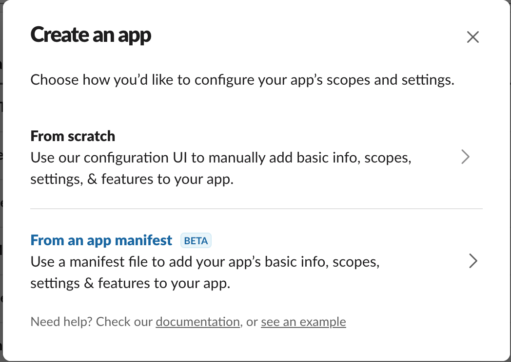
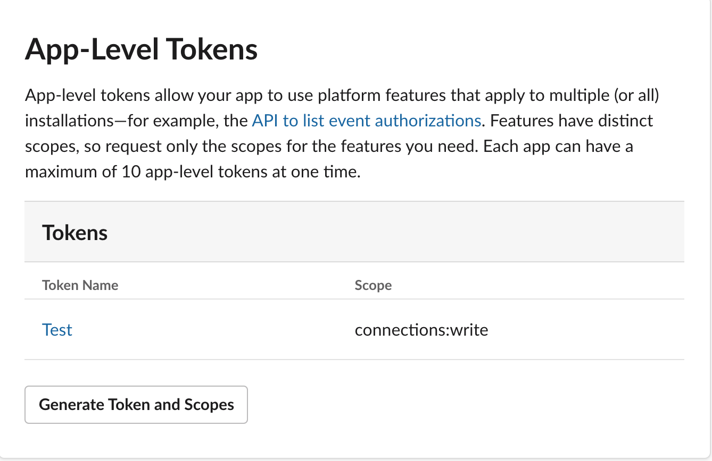
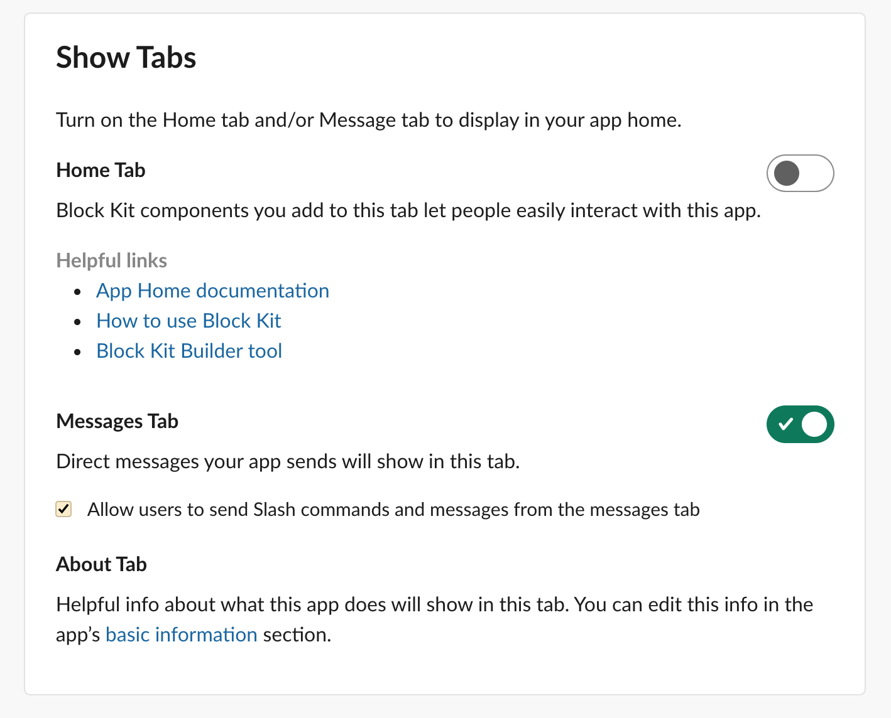

# Slack configuration
Before the installation I would recommend prepare the slack application for your account.
There are 2 ways of doing it - Legacy and New(Recommended)
 
## New
With the new way you will be able to create an application using the [slack-app_manifest.yml](../slack-app-manifest.yml) configuration, which is provided in root directory.
Below you can see more detailed instruction:

1. First go to [applications page](https://api.slack.com/apps?new_app=1)

2. I would recommend you to create the application from manifest, because it is simpler. If you decide to create the application from scratch, please make sure you add the scopes defined in [slack-app_manifest.yml](../slack-app-manifest.yml) 
3. After application created, please generate the application token with the scope like in image below. This token you need for `SLACK_OAUTH_TOKEN` variable

4. Install your application to the workspace
5. After installation, please go to `OAuth & Permissions` page and take the token from `Bot User OAuth Token` and add it to `SLACK_WEB_API_OAUTH_TOKEN` variable.
6. Switch `SLACK_LEGACY_BOT` to `false` for enabling the new way of websocket connection.
7. Enable send messages from `Direct messages Tab`

As the result you should set the next variables:
```
SLACK_OAUTH_TOKEN=
SLACK_WEB_API_OAUTH_TOKEN=
SLACK_LEGACY_BOT=false
```

## Legacy
This is the old way of the application configuration, where you will create a legacy application and use only one token for all actions of our bot.
Below you can see the instruction:

1. Go to [applications page](https://api.slack.com/apps?new_classic_app=1) of slack and create new application there
2. Once new application created you will be redirected to the application `Basic Information` page, where you have to click in the `Building Apps for Slack` section to the `Add features and functionality` block. There you need to click to the `Bots` button.
3. Add a Bot user. Specify the `Display name`, `Default username` and his `online status`
4. After you created a bot user, please go back to the `Basic Information` page and install your app to your workspace. You can find the `Install your app to your workspace` button in the `Building Apps for Slack` section.
5. Now you need to get the OAuth tokens for our bot user. For that please go to `OAuth & Permissions`, there you will find the `Bot User OAuth Access Token` which appears only after application installation to your slack account. This token you will need to specify in .env configuration file of your bot
6. Set the value from `Bot User OAuth Access Token` into *SLACK_OAUTH_TOKEN* variable in the `.env` file
7. Switch `SLACK_LEGACY_BOT` to `true` for enabling the legacy way of websocket connection
As the result you should set the next variables:
```
SLACK_OAUTH_TOKEN=
SLACK_LEGACY_BOT=true
```

