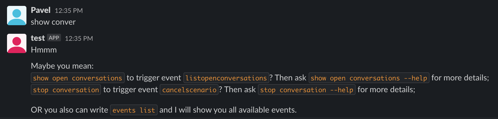

# Unknown question event
This event will be triggered when he don't know what to answer. He will try to share you potential events, which probably you've meant in the message.



## Installation guide
To install it please add it to `defined-events.go` and run next command:
``` 
make install
```

## Usage
Write in PM or tag the bot user with this message
```
some example
```
As good result you should receive an answer with the list of events
```text
Maybe you mean:
who are you? to trigger event example? Then ask who are you? --help for more details;
write a message to trigger event examplescenario? Then ask write a message --help for more details;
OR you also can write events list and I will show you all available events.
```